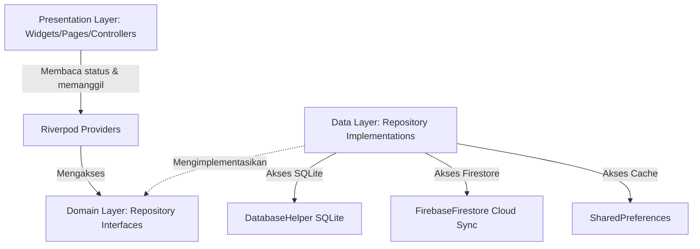
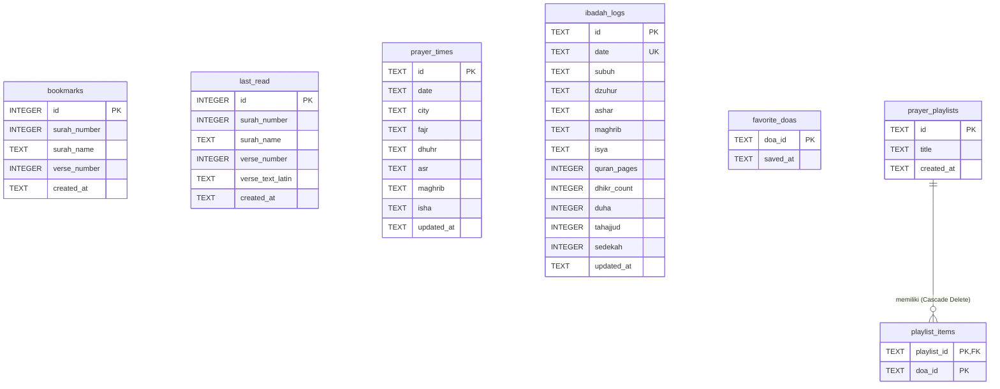
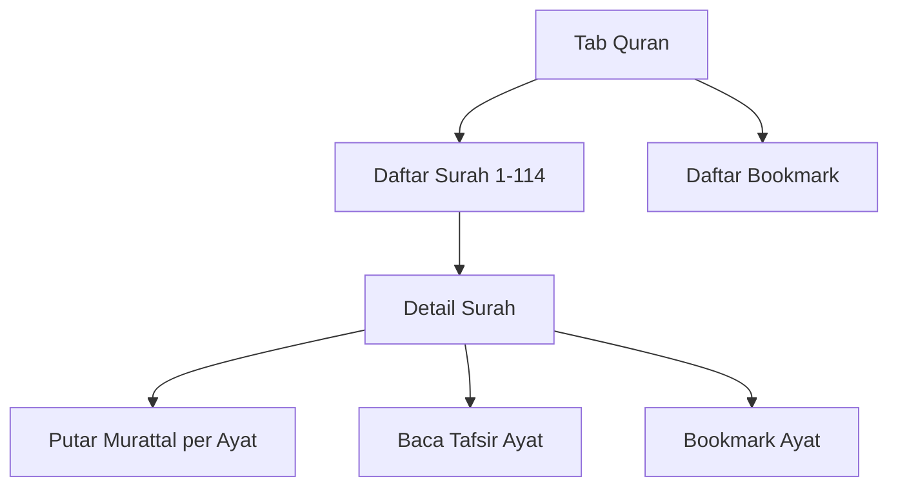
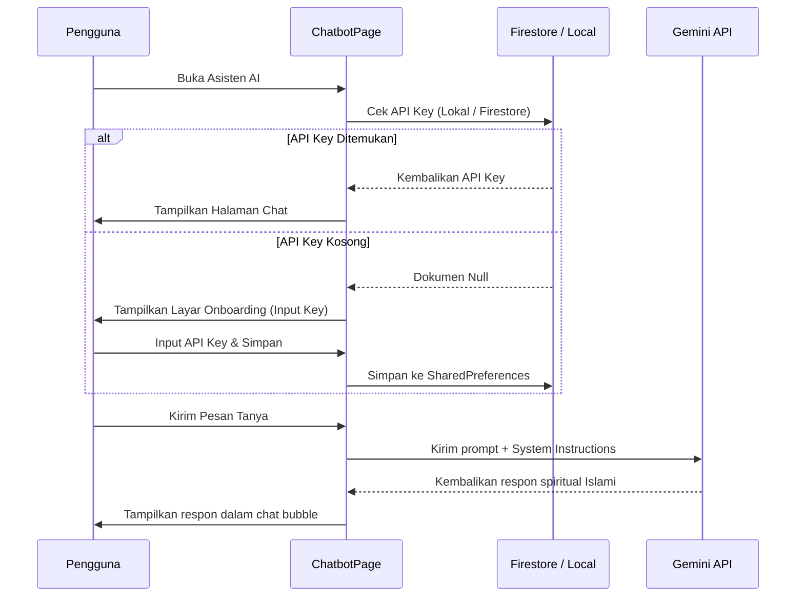

# 📝 Functional Specification Document (FSD)
## 🌙 Pedoman Hidup App — Versi 1.0.0

---

## 📌 Metadata Dokumen
| Informasi | Detail |
| :--- | :--- |
| **Nama Proyek** | Pedoman Hidup |
| **Versi Dokumen** | 1.0.0 |
| **Versi Aplikasi** | 1.0.0 |
| **Tanggal Pembuatan** | 2026-06-26 |
| **Status Dokumen** | Rilis (Approved) |
| **Target Platform** | Android, iOS |
| **Framework** | Flutter (Dart SDK) |

---

## 📖 1. Pendahuluan

### 1.1 Latar Belakang
**Pedoman Hidup** adalah aplikasi panduan ibadah Islami terpadu dan modern yang dirancang untuk mendukung aktivitas ibadah harian umat Muslim secara offline-first. Aplikasi ini memadukan kemudahan membaca Al-Quran, mencatat tracker ibadah harian, menghafal doa, serta berkonsultasi seputar ibadah sehari-hari menggunakan teknologi kecerdasan buatan (AI) yang sopan dan santun.

### 1.2 Tujuan Dokumen
Dokumen Spesifikasi Fungsional (FSD) ini bertujuan untuk mendefinisikan seluruh fungsi, arsitektur data, komponen UI/UX, alur pengguna, serta parameter teknis aplikasi **Pedoman Hidup** versi 1.0.0. Dokumen ini menjadi acuan utama bagi pengembang, penguji (QA), desainer, dan pemangku kepentingan.

---

## 🛠️ 2. Arsitektur & Spesifikasi Teknis

Aplikasi ini dirancang menggunakan prinsip **Clean Architecture** yang terbagi menjadi beberapa fitur terisolasi (*Feature-first structure*). Setiap fitur terbagi menjadi 3 lapisan utama:
1. **Data Layer**: Menangani database lokal SQLite, cache SharedPreferences, integrasi remote Firestore API, dan pembacaan model data.
2. **Domain Layer**: Menyimpan aturan bisnis murni bebas framework (Entitas dasar dan antarmuka/kontrak repositori).
3. **Presentation Layer**: Menangani komponen UI, Halaman, Widget Kustom, dan manajemen status aplikasi menggunakan Riverpod State Providers.

### 2.1 Stack Teknologi & Dependensi Utama
* **State Management**: `flutter_riverpod` (v2.5.1)
* **Basis Data Lokal**: `sqflite` (v2.3.0) & `shared_preferences` (v2.5.5)
* **Sinkronisasi Cloud & Autentikasi**: `firebase_core`, `firebase_auth`, `cloud_firestore`, `google_sign_in`
* **Mesin Audio (Murattal)**: `just_audio` (v0.10.5) & `audio_session` (v0.2.3)
* **Kecerdasan Buatan (AI)**: `google_generative_ai` (v0.4.1) (Gemini 1.5 Flash)
* **Komponen Grafis & Tipografi**: `google_fonts` (Outfit, Plus Jakarta Sans, Scheherazade New), `flutter_svg` (v2.0.10+1)

---

## 🗄️ 3. Desain Data (Skema SQLite)

Aplikasi menggunakan basis data lokal SQLite `pedoman_hidup.db` versi `2`. Penegakan integritas data dikonfigurasi menggunakan `PRAGMA foreign_keys = ON`.

### 3.1 Skema Tabel Database

#### Tabel 1: `bookmarks`
Menyimpan daftar ayat Al-Quran yang ditandai oleh pengguna.
* `id`: INTEGER PRIMARY KEY AUTOINCREMENT
* `surah_number`: INTEGER (Nomor Surah, 1 - 114)
* `surah_name`: TEXT (Nama Surah)
* `verse_number`: INTEGER (Nomor Ayat)
* `created_at`: TEXT (Format ISO8601 string)

#### Tabel 2: `last_read`
Menyimpan posisi terakhir membaca ayat Al-Quran (maksimal 1 entri).
* `id`: INTEGER PRIMARY KEY (Tetap bernilai 1)
* `surah_number`: INTEGER
* `surah_name`: TEXT
* `verse_number`: INTEGER
* `verse_text_latin`: TEXT
* `created_at`: TEXT

#### Tabel 3: `prayer_times`
Menyimpan cache jadwal shalat harian berdasarkan kota terpilih.
* `id`: TEXT PRIMARY KEY
* `date`: TEXT NOT NULL (Format YYYY-MM-DD)
* `city`: TEXT NOT NULL
* `fajr` / `dhuhr` / `asr` / `maghrib` / `isha`: TEXT NOT NULL (Waktu shalat format HH:mm)
* `updated_at`: TEXT NOT NULL

#### Tabel 4: `ibadah_logs`
Melacak riwayat checklist ibadah harian pengguna untuk grafik dan streak.
* `id`: TEXT PRIMARY KEY
* `date`: TEXT NOT NULL UNIQUE (Format YYYY-MM-DD)
* `subuh` / `dzuhur` / `ashar` / `maghrib` / `isya`: TEXT NOT NULL DEFAULT 'belum' (Nilai: 'selesai', 'terlewat', 'qadha', 'belum')
* `quran_pages`: INTEGER NOT NULL DEFAULT 0 (Jumlah halaman dibaca)
* `dhikr_count`: INTEGER NOT NULL DEFAULT 0 (Jumlah hitungan dzikir)
* `duha`: INTEGER NOT NULL DEFAULT 0 (Status shalat Duha: 1/0)
* `tahajjud`: INTEGER NOT NULL DEFAULT 0 (Status shalat Tahajjud: 1/0)
* `sedekah`: INTEGER NOT NULL DEFAULT 0 (Status sedekah: 1/0)
* `updated_at`: TEXT NOT NULL

#### Tabel 5: `favorite_doas`
Menyimpan ID doa yang difavoritkan oleh pengguna.
* `doa_id`: TEXT PRIMARY KEY
* `saved_at`: TEXT NOT NULL

#### Tabel 6: `prayer_playlists`
Menyimpan folder playlist doa kustom buatan pengguna.
* `id`: TEXT PRIMARY KEY
* `title`: TEXT NOT NULL (Judul playlist)
* `created_at`: TEXT NOT NULL

#### Tabel 7: `playlist_items`
Relasi relasional isi doa di dalam folder playlist kustom.
* `playlist_id`: TEXT NOT NULL (FOREIGN KEY REFERENCES `prayer_playlists(id)` ON DELETE CASCADE)
* `doa_id`: TEXT NOT NULL
* *Kunci Utama*: Gabungan `(playlist_id, doa_id)`

---

## 📱 4. Fitur Fungsional & Spesifikasi Alur

### 4.1 Dashboard Utama
Merupakan halaman pendaratan utama aplikasi yang didesain secara simetris untuk memberikan ringkasan status ibadah pengguna hari ini.
* **Header Greeting & Profil**: Menampilkan sapaan dinamis berdasarkan waktu ("Selamat Pagi", "Selamat Sore", dll.), nama pengguna, dan foto avatar. Jika terhubung ke Google, mengambil foto profil Google asli, berukuran 28dp dengan border emas halus. Dapat diklik untuk membuka halaman Pengaturan.
* **Kartu Ayat Hari Ini (Ayah of the Day)**: Menampilkan satu kutipan ayat Al-Quran acak dari database kurasi lengkap beserta teks latin, terjemahan, dan pemutar audio Murattal per ayat.
* **Lencana Istiqomah (Streak Badge)**: Menghitung secara real-time jumlah hari berturut-turut di mana pengguna mencatat minimal ada aktivitas shalat selesai (`_calculateWorshipStreak`). Ditandai dengan lencana api ("🔥 X Hari Istiqomah").
* **Worship Summary Dots**: Menampilkan status 5 shalat fardhu hari ini dalam bentuk 5 titik bulat berwarna interaktif:
  * **Emas (`#D4AF37`)**: Selesai tepat waktu.
  * **Merah**: Terlewat.
  * **Oranye**: Qadha.
  * **Abu-abu**: Belum diisi/belum tiba waktunya.
* **Banner Tanya AI Ustadz**: Kartu glassmorphic premium berkilau emas dengan ikon asisten spiritual. Mengarahkan pengguna langsung ke fitur Asisten AI Spiritual.

---

### 4.2 Al-Quran & Pembelajaran

* **Membaca Al-Quran Offline**: Daftar 114 Surah dengan fitur pencarian cepat berdasarkan nama surah latin/arab.
* **Tampilan Detail Surah**:
  * Teks Arab menggunakan font `Scheherazade New` dengan spasi baris yang disesuaikan secara ergonomis.
  * Teks Latin dan Terjemahan Bahasa Indonesia menggunakan font `Plus Jakarta Sans`.
  * Tombol aksi per ayat: Putar Audio per Ayat (Murattal), Buka Tafsir, Salin Ayat, Bagikan Ayat, dan Tambah Bookmark.
* **Pemutar Audio Ayat**: Menggunakan `just_audio` untuk melakukan *streaming* suara qari yang berjalan secara halus dengan indikator memuat (*loading state*) visual.
* **Tafsir Detail**: Halaman khusus yang menampilkan tafsir lengkap Kemenag RI untuk ayat bersangkutan.
* **Menu Belajar Hijaiyah**: Berisi daftar huruf Hijaiyah lengkap dengan cara pelafalan, penulisan, dan audio panduan suara makhorijul huruf.
* **Hukum Tajwid**: Pembelajaran interaktif 12 hukum tajwid (seperti Ikhfa, Idgham, Qalqalah, dll.) dilengkapi dengan contoh lafal dan audio latihan. Klik pada contoh memicu dialog detail hukum tajwid.
* **Kuis Quranic**: Evaluasi pemahaman Al-Quran dan hukum tajwid pengguna dengan sistem kuis interaktif berbatas waktu.

---

### 4.3 Ibadah Hub
Merupakan panel kendali pencatatan aktivitas spiritual harian pengguna.
* **Jadwal Shalat Aktual**: Menampilkan waktu shalat 5 waktu (Subuh, Dzuhur, Ashar, Maghrib, Isya) berdasarkan lokasi geospasial/kota yang dipilih secara otomatis.
* **Checklist Riwayat Harian**: Pengguna dapat mencentang status shalat wajib harian dengan memilih opsi status (Selesai, Terlewat, Qadha, Belum). Data disimpan instan di database lokal SQLite.
* **Tracker Ibadah Sunnah & Tilawah**:
  * Input numerik halaman Al-Quran yang dibaca hari ini.
  * Penghitung dzikir harian.
  * Checklist Shalat Sunnah Duha & Tahajjud.
  * Checklist Sedekah harian.
* **Kalender Riwayat**: Menampilkan log historis pengisian ibadah hari-hari sebelumnya untuk evaluasi konsistensi spiritual.

---

### 4.4 Kumpulan Doa & Dzikir
Menyediakan referensi doa-doa pilihan dalam format yang mudah diakses.
* **Kategori Doa**: Doa dikelompokkan secara terstruktur (Doa Harian, Doa Ibadah, Doa Perlindungan, dll.).
* **Dzikir Setelah Shalat**: Panduan dzikir lengkap seturut sunnah Nabi SAW setelah menyelesaikan shalat fardhu, lengkap dengan counter tasbih digital langsung di layar.
* **Fitur Playlist Doa Kustom**:
  * Pengguna dapat membuat folder/playlist doa buatan sendiri (misalnya: "Playlist Pagi Hari", "Doa Musafir").
  * Memasukkan doa pilihan ke dalam satu atau beberapa playlist melalui modal `AddToPlaylistSheet`.
  * Halaman detail playlist untuk mengurutkan doa, mengganti nama folder, atau menghapus playlist seutuhnya.

---

### 4.5 Asisten AI Spiritual (Gemini)

* **Keamanan Kunci API**: Key Gemini diambil secara aman dengan alur bertahap:
  1. Membaca `SharedPreferences` perangkat lokal.
  2. Jika kosong, mengunduh secara otomatis dari Firebase Firestore pada dokumen `/config/chatbot` (field `apiKey`).
  3. Jika masih kosong, menyajikan layar onboarding premium dengan kotak input API Key aman dan tautan langsung untuk membuat API Key gratis di Google AI Studio.
* **Model AI**: Menggunakan `gemini-1.5-flash` dengan konfigurasi *System Instructions* ketat:
  > **System Instructions**:
  > *"Anda adalah 'Asisten Islami Pedoman Hidup', sebuah chatbot spiritual digital yang ramah, sopan, bijaksana, dan menyejukkan. Tugas Anda adalah membantu pengguna menjawab pertanyaan seputar ibadah sehari-hari (seperti shalat, puasa, zakat, dzikir, doa), memberikan motivasi beribadah, menyarankan doa-doa dari Al-Qur'an dan Hadits, serta memberikan nasihat spiritual yang damai dan menyejukkan hati. Gunakan bahasa Indonesia yang santun, bersahabat, penuh empati, dan menyejukkan. Selalu kutip referensi dari Al-Qur'an (nama Surah dan Ayat) atau Hadits (nama Periwayat seperti Bukhari, Muslim, Tirmidzi, dll) secara jelas bila Anda memberikan kutipan atau dalil. Bila ditanya di luar topik agama Islam, adab kehidupan, atau motivasi ibadah, arahkan percakapan secara halus kembali ke ranah spiritual dan ibadah harian."*
* **Tampilan Obrolan**: Gelembung percakapan dengan efek glassmorphic premium, status pengetikan animasi (*typing indicator*), serta tombol bersihkan riwayat obrolan secara instan.

---

### 4.6 Akun & Sinkronisasi Cloud
Menyediakan fitur pencadangan data otomatis bagi pengguna agar data tidak hilang saat berganti perangkat.
* **Otentikasi**: Menggunakan Google Sign-In terintegrasi dengan Firebase Auth.
* **Offline-First Synchronization**: Seluruh data yang disimpan pada SQLite lokal disinkronkan secara dua arah (*two-way sync*) ke Firebase Firestore secara aman setelah login berhasil.
* **Data yang Disinkronkan**:
  1. Bookmarks (`/users/{uid}/bookmarks/*`)
  2. Posisi Terakhir Membaca / Last Read (`/users/{uid}/last_read/info`)
  3. Riwayat Checklist Ibadah (`/users/{uid}/ibadah_logs/*`)
  4. Doa Favorit (`/users/{uid}/favorite_doas/*`)
  5. Playlist Kustom (`/users/{uid}/playlists/*` dan `/users/{uid}/playlist_items/*`)
* **Pemicu Sinkronisasi**: Berjalan otomatis saat login pertama kali, startup aplikasi, dan dapat dipicu secara manual melalui menu pengaturan.

---

## 🎨 5. Desain Visual & Token UI/UX

Aplikasi dirancang agar memiliki impresi visual premium, elegan, dan menenangkan jiwa dengan perpaduan warna Islami berkelas tinggi:

### 5.1 Skema Warna & Aset
* **Emerald Green (Primary)**: `#0B3B24` (Representasi keteduhan dan warna khas surga).
* **Accent Gold (Secondary)**: `#D4AF37` (Aksen kemewahan emas pada garis tepi, teks ikon, dan penyorotan aktif).
* **Latar Belakang Gelap**: `#070C09` (Emerald-black solid untuk estetika malam).
* **Latar Belakang Terang**: `#F3F6F4` (Soft green-white untuk ketajaman baca siang hari).
* **Gaya Aset Logo**: Desain geometri Bintang 16 sudut presisi dengan gradasi warna emas berkilau (`#FFF3B3` ke `#D4AF37`) di atas latar hijau emerald.

### 5.2 Efek Ambient Light Glow (Khasiat Dark Mode)
Pendaran gradien ambient yang menenangkan jiwa terletak di balik konten:
* Sudut kiri atas memancarkan bias warna hijau zamrud (`primaryEmerald.withOpacity(0.08)`).
* Sudut kanan bawah memancarkan bias emas hangat (`accentGold.withOpacity(0.05)`).
* Efek bias dihaluskan menggunakan `BackdropFilter` dengan `ImageFilter.blur(sigmaX: 120, sigmaY: 120)`.

### 5.3 Notched Navigation Bar
Navigasi bawah menggunakan `BottomAppBar` dengan lengkungan notch yang sangat mulus (`CircularNotchedRectangle` dan `notchMargin: 8`). Di bagian tengah notch disematkan Floating Action Button (FAB) bulat mengambang yang memuat logo Bintang 16 emas.
* Item menu navigasi aktif memicu animasi naik ke atas sebesar -4px secara vertikal (`translationValues`) dan membesar (`scale: 1.15`) menggunakan efek pantulan `Curves.easeOutBack`.

---

## 📊 6. Skenario Pengujian UAT (User Acceptance Testing)

| Kode Test | Deskripsi Pengujian | Hasil yang Diharapkan | Status |
| :--- | :--- | :--- | :--- |
| **UAT-001** | Autentikasi Google Sign-In | Pengguna dapat masuk menggunakan akun Google mereka, mengambil nama & foto profil asli secara dinamis. | Lulus |
| **UAT-002** | Sinkronisasi Dua Arah Offline-First | Seluruh data SQLite lokal terunggah ke Firebase Firestore sesaat setelah login, dan terunduh otomatis saat dipasang di perangkat baru. | Lulus |
| **UAT-003** | Inisialisasi API Key Chatbot Gemini | Halaman chatbot mendeteksi API Key di Firestore `/config/chatbot`, melewati layar onboarding, dan langsung mengaktifkan sesi obrolan. | Lulus |
| **UAT-004** | Keamanan Onboarding Chatbot | Jika API key kosong di lokal & Firestore, menampilkan onboarding input manual dengan tautan ke Google AI Studio. | Lulus |
| **UAT-005** | Respons Karakter Islami Chatbot | Chatbot Gemini membalas prompt pengguna dengan nuansa ramah, menyejukkan, serta menyisipkan dalil ayat/hadits yang relevan. | Lulus |
| **UAT-006** | Pemutar Audio Murattal | Berhasil memutar audio Murattal per ayat secara bergantian tanpa terjadi *lag* atau tabrakan audio. | Lulus |
| **UAT-007** | Playlist Doa Kustom | Pengguna dapat membuat playlist baru, menambahkan doa dari repositori, dan melihatnya terkumpul di tab "Playlist Saya". | Lulus |
| **UAT-008** | Lencana Istiqomah (Streak) | Log pengisian shalat wajib menghitung secara konsisten jumlah streak harian dan menampilkan lencana api di Dashboard. | Lulus |
| **UAT-009** | Build Produksi (APK Release) | Perintah `flutter build apk --release` berhasil dikompilasi tanpa adanya error lint analyzer maupun kegagalan kompilasi gradle. | Lulus |

---
Dokumen FSD ini resmi disahkan untuk dijadikan basis pengembangan dan pengujian operasional aplikasi **Pedoman Hidup** versi 1.0.0.
