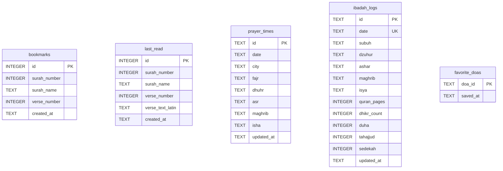

# 📝 Functional Specification Document (FSD)
## 🌙 Pedoman Hidup App — Versi 1.0.0

---

## 📌 Metadata Dokumen
| Informasi | Detail |
| :--- | :--- |
| **Nama Proyek** | Pedoman Hidup |
| **Versi Dokumen** | 1.0.0 |
| **Versi Aplikasi** | 1.0.0 |
| **Tanggal Pembuatan** | 2026-06-23 |
| **Status Dokumen** | Rilis (Baseline) |
| **Target Platform** | Android, iOS |
| **Framework** | Flutter (Dart SDK) |

---

## 📖 1. Pendahuluan

### 1.1 Latar Belakang
**Pedoman Hidup** adalah aplikasi panduan ibadah Islami offline-first yang menyediakan akses mandiri ke kitab suci Al-Quran, log harian shalat wajib dan sunnah, serta katalog doa harian. Aplikasi ini ditujukan untuk mendukung ibadah pengguna tanpa memerlukan koneksi internet aktif.

### 1.2 Tujuan Dokumen
Dokumen ini mendefinisikan spesifikasi fungsional awal dan arsitektur dasar dari versi rilis pertama (v1.0.0) Pedoman Hidup App.

---

## 🛠️ 2. Arsitektur & Spesifikasi Teknis

Aplikasi ini menggunakan arsitektur modular sederhana dengan pembagian fitur terisolasi.
1. **Data Layer**: Klien basis data lokal SQLite dan penyimpanan cache sederhana SharedPreferences.
2. **Domain Layer**: Model data entitas bisnis murni.
3. **Presentation Layer**: Widget UI Flutter dan Riverpod providers untuk melacak status.

### 2.1 Stack Teknologi Utama
* **State Management**: `flutter_riverpod` (v2.5.1)
* **Basis Data Lokal**: `sqflite` (v2.3.0) & `shared_preferences` (v2.5.5)
* **Mesin Audio (Murattal)**: `just_audio` (v0.10.5) & `audio_session` (v0.2.3)
* **Grafis & Desain**: `flutter_svg`, `google_fonts`

---

## 🗄️ 3. Desain Data (Skema SQLite v1)

Pada versi 1.0.0, basis data lokal SQLite `pedoman_hidup.db` beroperasi pada versi `1`.

### 3.1 Skema Tabel Database

* **Tabel bookmarks**: Menyimpan daftar ayat yang ditandai favorit secara lokal.
* **Tabel last_read**: Menyimpan satu baris penunjuk lokasi terakhir membaca Quran.
* **Tabel prayer_times**: Menyimpan jadwal shalat harian hasil unduhan kota terkait.
* **Tabel ibadah_logs**: Menyimpan centang checklist ibadah harian.
* **Tabel favorite_doas**: Menyimpan ID doa katalog yang difavoritkan.

---

## 📱 4. Fitur Fungsional (v1.0.0)

### 4.1 Dashboard Utama
* **Header Greeting & Profil**: Menampilkan sapaan dinamis berdasarkan waktu secara statis (Guest Profile).
* **Streak Tracker**: Menampilkan streak ibadah berdasarkan kalkulasi data logs SQLite lokal.
* **Worship Summary Dots**: 5 titik indikator shalat wajib hari ini (Emas untuk selesai, merah terlewat, oranye qadha, abu-abu belum).
* **Ayat Hari Ini**: Potongan ayat Al-Quran harian terpilih beserta pemutar audio.

### 4.2 Al-Quran & Pembelajaran
* **Daftar Surah**: Membaca Al-Quran 30 Juz secara offline lengkap dengan terjemahan.
* **Detail Surah**: Pemutar audio per ayat, pembukaan tafsir Kemenag per ayat, salin/bagikan ayat, dan bookmark.
* **Belajar Hijaiyah**: Audio panduan pelafalan huruf hijaiyah.
* **Tajwid Rules**: Panduan hukum tajwid dan pemutaran audio contoh lafal.
* **Kuis**: Evaluasi tajwid dan pengetahuan Al-Quran.

### 4.3 Ibadah Hub
* **Jadwal Shalat**: Waktu shalat harian berdasarkan kota terpilih.
* **Checklist Ibadah**: Pengisian checklist shalat fardhu harian dan amalan sunnah (Duha, Tahajjud, Sedekah).

### 4.4 Kumpulan Doa & Dzikir
* **Kategori Doa**: Daftar kumpulan doa pilihan (Doa Harian, Doa Ibadah, dll.).
* **Dzikir Setelah Shalat**: Panduan dzikir lengkap beserta tasbih counter digital interaktif.

---

## 🎨 5. Desain Visual
* **Tema**: Emerald Green & Gold (`#0B3B24` & `#D4AF37`).
* **Ambient Lights**: Pendaran cahaya hijau/emas di belakang halaman pada mode gelap.
* **Navigation Bar**: Bottom AppBar notched dengan Elevated FAB di tengah (Mosque icon).
