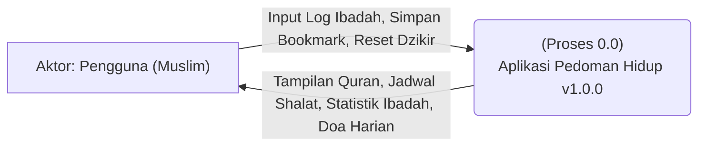
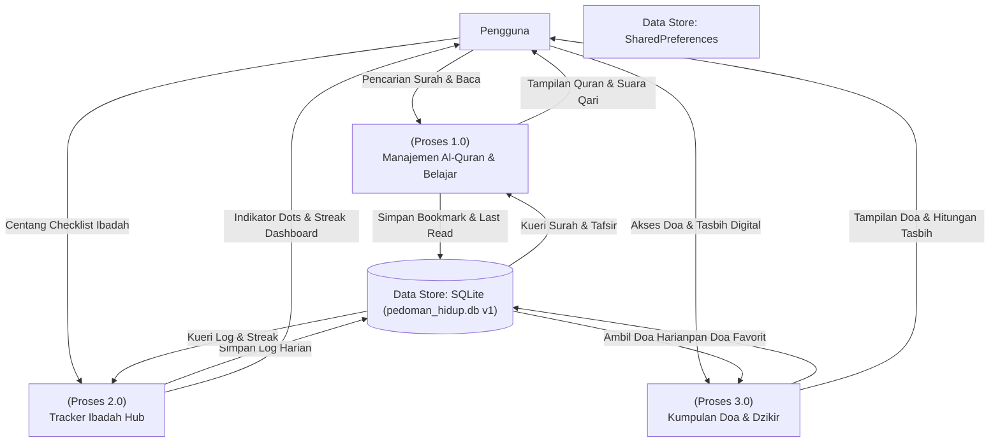
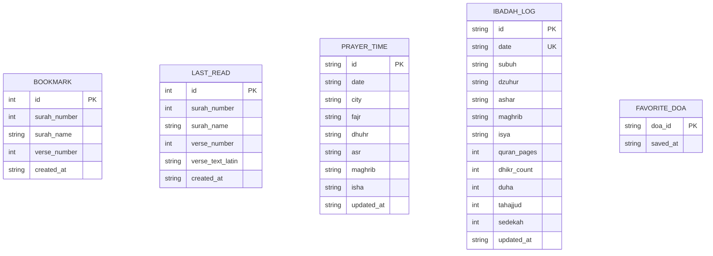

# 📐 Dokumen Perancangan Sistem (System Design Document)
## 🌙 Pedoman Hidup App — Versi 1.0.0

Dokumen ini berisi spesifikasi perancangan sistem formal untuk **Pedoman Hidup App** versi 1.0.0 yang mencakup **Use Case Diagram & Spesifikasi**, **Data Flow Diagram (DFD) Level 0 & 1**, serta **Entity Relationship Diagram (ERD)** detail.

---

## 🎭 1. Use Case Diagram (v1.0.0)

Pada versi 1.0.0, aplikasi berjalan sepenuhnya offline tanpa fitur autentikasi cloud.

```mermaid
usecaseDiagram
    %% Actors
    actor Pengguna as "Pengguna (Muslim)"

    %% Use Cases
    usecase UC01 as "UC01: Membaca Al-Quran & Tafsir"
    usecase UC02 as "UC02: Memutar Audio Murattal per Ayat"
    usecase UC03 as "UC03: Bookmark Ayat Terpilih"
    usecase UC04 as "UC04: Belajar Huruf Hijaiyah & Tajwid"
    usecase UC05 as "UC05: Mengikuti Kuis Pemahaman"
    usecase UC06 as "UC06: Mencatat Log Checklist Ibadah"
    usecase UC07 as "UC07: Membaca Doa & Dzikir Harian"

    %% Relationships
    Pengguna --> UC01
    Pengguna --> UC02
    Pengguna --> UC03
    Pengguna --> UC04
    Pengguna --> UC05
    Pengguna --> UC06
    Pengguna --> UC07
```

---

## 🔄 2. Data Flow Diagram (DFD v1.0.0)

### 2.1 DFD Level 0 (Diagram Konteks)
Diagram konteks awal hanya berinteraksi dengan satu entitas luar (Pengguna) karena pengoperasian yang bersifat lokal.



### 2.2 DFD Level 1
DFD Level 1 menjabarkan modul fungsional utama versi 1.0.0.



---

## 🗄️ 3. Entity Relationship Diagram (ERD v1.0.0)

### 3.1 Logical ERD (Diagram Mermaid)


Dokumen perancangan awal (v1.0.0) diarsipkan dengan aman untuk melacak sejarah struktural sistem.
