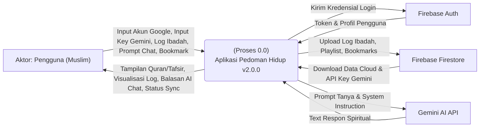
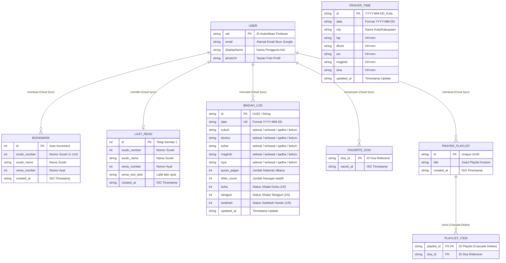

# 📐 Dokumen Perancangan Sistem (System Design Document)
## 🌙 Pedoman Hidup App — Versi 2.0.0

Dokumen ini berisi spesifikasi perancangan sistem formal untuk **Pedoman Hidup App** versi 2.0.0 yang mencakup **Use Case Diagram & Spesifikasi**, **Data Flow Diagram (DFD) Level 0 & 1**, serta **Entity Relationship Diagram (ERD)** detail.

---

## 📌 Metadata Perancangan
| Parameter | Keterangan |
| :--- | :--- |
| **Proyek** | Pedoman Hidup |
| **Dibuat Berdasarkan** | [FSD v2.0.0](file:///h:/Flutter%20Project/pedoman_hidup_app/documentation/v2.0.0/fsd.md) |
| **Penyusun** | Pasangan Pemrograman AI (Antigravity) |
| **Format Diagram** | Mermaid.js (Renders live in Markdown) |

---

## 🎭 1. Use Case Diagram & Spesifikasi

Use Case Diagram menggambarkan interaksi antara aktor (internal dan eksternal) dengan fungsi-fungsi utama di dalam sistem.

### 1.1 Use Case Diagram (Mermaid)

```mermaid
usecaseDiagram
    %% Actors
    actor Pengguna as "Pengguna (Muslim)"
    actor GoogleAuth as "Firebase Auth (Google Sign-In)"
    actor Firestore as "Firebase Firestore"
    actor GeminiAI as "Google Gemini AI API"

    %% Use Cases
    usecase UC01 as "UC01: Autentikasi Akun (Google Sign-In)"
    usecase UC02 as "UC02: Sinkronisasi Data Cloud"
    usecase UC03 as "UC03: Membaca Al-Quran & Tafsir"
    usecase UC04 as "UC04: Memutar Audio Murattal per Ayat"
    usecase UC05 as "UC05: Bookmark Ayat Terpilih"
    usecase UC06 as "UC06: Belajar Huruf Hijaiyah & Tajwid"
    usecase UC07 as "UC07: Mengikuti Kuis Pemahaman Al-Quran"
    usecase UC08 as "UC08: Mencatat Log Checklist Ibadah"
    usecase UC09 as "UC09: Membaca Doa & Dzikir Harian"
    usecase UC10 as "UC10: Mengelola Playlist Doa Kustom"
    usecase UC11 as "UC11: Konsultasi Tanya Asisten AI Spiritual"

    %% Relationships (Pengguna)
    Pengguna --> UC01
    Pengguna --> UC02
    Pengguna --> UC03
    Pengguna --> UC04
    Pengguna --> UC05
    Pengguna --> UC06
    Pengguna --> UC07
    Pengguna --> UC08
    Pengguna --> UC09
    Pengguna --> UC10
    Pengguna --> UC11

    %% Relationships (External Actors)
    UC01 --> GoogleAuth
    UC02 --> Firestore
    UC11 --> GeminiAI
```

### 1.2 Spesifikasi Detail Use Case Utama

#### UC02: Sinkronisasi Data Cloud
* **Aktor Utama**: Pengguna, Firebase Firestore (Sistem Eksternal).
* **Pre-kondisi**: Pengguna telah login menggunakan akun Google.
* **Alur Utama (Skenario Sukses)**:
  1. Pengguna membuka aplikasi atau menekan tombol "Sinkronkan Sekarang" di menu Pengaturan.
  2. Sistem membaca data dari database lokal SQLite (`bookmarks`, `last_read`, `ibadah_logs`, `favorite_doas`, `playlists`, `playlist_items`).
  3. Sistem membandingkan timestamp data lokal dengan Firestore.
  4. Sistem mengunggah data lokal baru ke Firestore.
  5. Sistem mengunduh data cloud baru yang belum ada di database lokal.
  6. Sistem memperbarui waktu sinkronisasi terakhir di `SharedPreferences`.
* **Alternatif / Exception**: Jika jaringan internet terputus, sistem mengubah status sinkronisasi menjadi `failure` dan mempertahankan data di SQLite lokal untuk dicoba kembali nanti (Offline-first).

#### UC10: Mengelola Playlist Doa Kustom
* **Aktor Utama**: Pengguna.
* **Pre-kondisi**: Berada pada menu Doa & Dzikir.
* **Alur Utama**:
  1. Pengguna membuka tab "Playlist Saya".
  2. Pengguna membuat folder playlist baru dengan memasukkan judul (misal: "Doa Pagi Hari").
  3. Sistem membuat entri di SQLite tabel `prayer_playlists`.
  4. Pengguna mencari doa dari daftar referensi dan memilih opsi "Tambah ke Playlist".
  5. Sistem memunculkan modal daftar playlist dan pengguna mencentang playlist target.
  6. Sistem menyimpan relasi ID doa dan ID playlist di tabel `playlist_items`.
  7. Jika pengguna masuk akun Google, sistem otomatis memicu sinkronisasi ke Firestore.

#### UC11: Konsultasi Tanya Asisten AI Spiritual
* **Aktor Utama**: Pengguna, Gemini AI API (Sistem Eksternal).
* **Pre-kondisi**: Aplikasi memiliki API Key Gemini (diambil otomatis dari Firestore `/config/chatbot` atau diinput manual oleh user).
* **Alur Utama**:
  1. Pengguna masuk ke halaman "Asisten AI Spiritual" dari Dashboard.
  2. Pengguna mengetik pertanyaan/curhatan seputar ibadah sehari-hari.
  3. Sistem mengirimkan teks pertanyaan dibungkus bersama *System Instructions* spiritual Islami dan riwayat chat ke Gemini AI API.
  4. Gemini AI API mengembalikan respon teks Islami lengkap dengan referensi surah/hadits.
  5. Sistem menampilkan pesan balasan dalam gelembung obrolan glassmorphic.
* **Alternatif**: Jika API Key belum terkonfigurasi, aplikasi mengalihkan pengguna ke layar Onboarding API Key terlebih dahulu.

---

## 🔄 2. Data Flow Diagram (DFD)

DFD menggambarkan aliran data yang masuk dan keluar dari entitas eksternal ke dalam proses sistem, serta penyimpanannya (*data stores*).

### 2.1 DFD Level 0 (Diagram Konteks)
Diagram konteks menggambarkan batasan sistem aplikasi dengan entitas luar.



---

### 2.2 DFD Level 1
DFD Level 1 menjabarkan modul-modul fungsional internal aplikasi dan interaksinya dengan penyimpanan data (*data stores* lokal).

```mermaid
graph TD
    %% Entities
    User[Pengguna]
    Auth[Firebase Auth]
    Cloud[Firebase Firestore]
    Gemini[Gemini AI API]

    %% Data Stores
    subcopy["Data Store: SharedPreferences"]
    subdb[("Data Store: SQLite (pedoman_hidup.db)")]

    %% Processes
    P1["(Proses 1.0)<br/>Manajemen Login & Auth"]
    P2["(Proses 2.0)<br/>Manajemen Al-Quran & Belajar"]
    P3["(Proses 3.0)<br/>Tracker Ibadah Hub"]
    P4["(Proses 4.0)<br/>Kumpulan Doa & Playlist"]
    P5["(Proses 5.0)<br/>Layanan Asisten AI Chat"]
    P6["(Proses 6.0)<br/>Sinkronisasi Data Offline-First"]

    %% Flows P1
    User -->|Login Google| P1
    P1 -->|Kredensial| Auth
    Auth -->|Token & Profil| P1
    P1 -->|Simpan Status Login| subcopy

    %% Flows P2
    User -->|Navigasi & Baca| P2
    P2 -->|Simpan Bookmark & Posisi Baca| subdb
    subdb -->|Kueri Surah/Ayat/Tajwid| P2
    P2 -->|Tampilan Al-Quran & Audio| User
    P2 -->|Kirim Halaman Dibaca (Auto Sync)| P3

    %% Flows P3
    User -->|Centang Ibadah & Set Target| P3
    P3 -->|Simpan Riwayat Harian| subdb
    subdb -->|Kalkulasi Streak & Log| P3
    P3 -->|Visualisasi Lencana & Dots| User

    %% Flows P4
    User -->|Kelola Playlist Doa| P4
    P4 -->|Simpan Playlist & Doa Favorit| subdb
    subdb -->|Ambil Doa & Playlist| P4
    P4 -.->|Simpan/Ambil Last Pick Playlist| subcopy
    P4 -->|Tampilan Daftar Doa Kustom| User

    %% Flows P5
    User -->|Input Pertanyaan Chat| P5
    P5 -.->|1. Ambil Key Lokal| subcopy
    P5 -.->|2. Ambil Key Global| P6
    P5 -->|Prompt + Key + System Instruction| Gemini
    Gemini -->|Jawaban Motivasi Islami| P5
    P5 -->|Balasan Gelembung Obrolan| User

    %% Flows P6
    P6 -->|Ambil Kunci API / Simpan Sinkronisasi| Cloud
    Cloud -->|Unduh Data Cloud Lama| P6
    P6 -->|Query & Tulis Data Sinkron| subdb
```

---

## 🗄️ 3. Entity Relationship Diagram (ERD)

ERD menggambarkan struktur logis basis data, atribut-atribut entitas, serta kardinalitas relasi antar-entitas.

### 3.1 Logical ERD (Diagram Mermaid)



### 3.2 Kamus Data & Kardinalitas Relasi

1. **Relasi `USER` ke `BOOKMARK` (1 ke Banyak)**
   * Setiap kali Pengguna masuk dengan akun Google, databasenya diidentifikasi dengan `uid`. Pengguna dapat memiliki **nol hingga banyak** bookmark ayat.
   * Sinkronisasi Cloud memetakan entri bookmark lokal ke dalam Firestore dengan filter `/users/{uid}/bookmarks/{surah_verse}`.

2. **Relasi `USER` ke `LAST_READ` (1 ke 1)**
   * Setiap Pengguna hanya dapat memiliki **maksimal satu** posisi terakhir membaca ayat Al-Quran.
   * Di Firestore dipetakan pada path dokumen tunggal `/users/{uid}/last_read/info` untuk menghemat pembacaan dokumen.

3. **Relasi `PRAYER_PLAYLIST` ke `PLAYLIST_ITEM` (1 ke Banyak dengan Cascade Delete)**
   * Setiap folder playlist dapat menampung **satu hingga banyak** item doa.
   * Aturan basis data lokal SQLite: `FOREIGN KEY (playlist_id) REFERENCES prayer_playlists (id) ON DELETE CASCADE`. Jika baris folder playlist dihapus oleh pengguna, seluruh item doa yang berelasi di tabel `playlist_items` akan langsung terhapus secara otomatis oleh database engine.

4. **Kemandirian `PRAYER_TIME` (Tanpa Relasi Relasional)**
   * Tabel `prayer_times` bertindak as data cache offline independen. Data jadwal shalat ditarik berkala menggunakan API eksternal berdasarkan waktu lokal, dan tidak memerlukan relasi asing (*foreign keys*) ke entitas pengguna agar dapat diakses supercepat tanpa proses *join join* tabel.

---
Dokumen rancangan sistem ini valid, konsisten, dan siap digunakan untuk memandu pengembangan skema database, perancangan antarmuka controller (State Management), serta penataan alur sinkronisasi data cloud Firebase.
